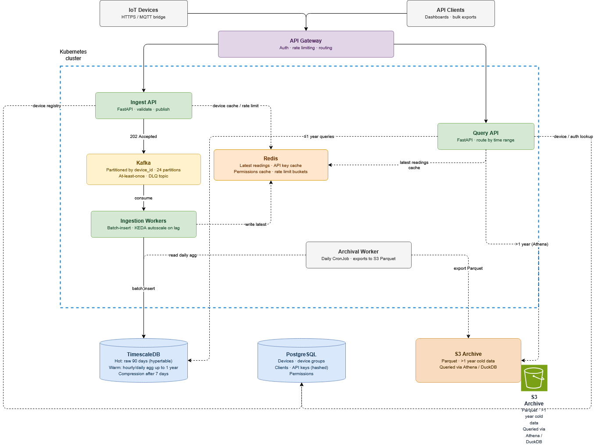

# TelemetryNL Platform – Design Document
 
 
## Assumptions
 
- Devices are pre-registered before they can push data; unknown device identifiers are rejected at ingest.
  - API to register new devices is not contemplated on the desgin but is easy to attach
- A reading is: `device_id`, `timestamp`, `metric_name` (e.g. `temperature`), `value` (float64).
- "Latest reading" means the most recent value per metric per device.
- Interactive dashboards query the last 30–90 days; bulk historical exports query years. These have very different latency requirements and are served differently.
- Cloud provider: Any major provider, AWS selected for the case of study (generic building blocks used throughout).
- Deployment: Kubernetes on managed nodes (EKS/GKE/AKS). IaC via Terraform.
---
 
## Scale reference
 
| Metric | Current (100k devices) | Target (1M devices) |
|---|---|---|
| Readings/sec (avg) | ~3,300 | ~33,000 |
| Readings/day | ~288M | ~2.88B |
| Raw storage/day (compressed ~50 bytes/row) | ~14 GB | ~140 GB |
| Cumulative storage at 2 years | ~10 TB | ~100 TB |
 
---
 
## Architecture Diagram
 
See the accompanying interactive SVG diagram. Data flows left-to-right / top-to-bottom:


 
- **Write path (solid arrows):** IoT Devices → API Gateway → Ingest API → Kafka → Ingestion Workers → TimescaleDB
- **Cache/archival (dashed):** Query API ↔ Redis; Archival Workers → S3
- **Shared by all services:** PostgreSQL (device registry, auth, permissions)
---
 
## Design Document
 
### Data Ingestion
 
#### Protocol
 
Devices push readings over **HTTPS REST** (`POST /v1/ingest/readings` or `/batch`). Rationale:
 
- HTTPS works through every firewall, NAT, and proxy. No special network configuration required on-site.
- TLS encryption is built in.
- Simple to implement on any platform (including constrained microcontrollers with HTTP libraries).


For devices that are genuinely constrained to MQTT (low-power, cellular-only), a managed **MQTT broker** (e.g. AWS IoT Core or self-hosted EMQX) bridges to Kafka via a connector. This is a secondary path and not in the critical design.
 
#### Buffering: Kafka
 
The Ingest API does not write directly to the database. Instead, it **publishes validated readings to Kafka** and returns `202 Accepted`. Ingestion Workers consume from Kafka and write to TimescaleDB at their own pace.
 
**Why Kafka over a simpler queue:**
- Handles the full 33k msg/sec comfortably with horizontal scaling.
- Topics are durable and replicated; data survives worker restarts and downstream slowdowns.
- Consumer groups allow multiple downstream consumers (ingestion, real-time alerting, audit) from the same stream.
- Replay capability: if a bug corrupts a batch, rewind the offset and reprocess.
**Partition strategy:** Partition by `hash(device_id)`. This ensures all readings from one device go to the same partition (and same worker), preserving per-device ordering. Start with **24 partitions**; increase as throughput grows.
 
#### Validation
 
The Ingest API validates each reading before publishing:
 
1. **Schema check:** all required fields present and correctly typed.
2. **Device check:** `device_identifier` exists in PostgreSQL device registry (cached in Redis, TTL 60s).
3. **Timestamp sanity:** within ±5 minutes of server time (rejects replayed or clock-skewed readings).
4. **Metric name:** alphanumeric + underscores only, max 100 characters.
**Invalid readings** are published to a `readings.dead-letter` Kafka topic with a rejection code and the original payload. They never reach TimescaleDB. A separate process monitors the dead-letter topic for alerting and operational review.
 
#### At-least-once delivery guarantee
 
1. Device sends reading via HTTPS.
2. Ingest API validates → publishes to Kafka → waits for Kafka broker ACK (`acks=all`).
3. Ingest API returns `202 Accepted` to device.
4. Ingestion Worker consumes message → writes to TimescaleDB → commits Kafka offset.
5. If the TimescaleDB write fails, the worker does **not** commit the offset. Kafka redelivers on the next poll. The worker retries with exponential backoff.
6. Duplicate readings from retries are deduplicated at storage level: the primary key on `(device_id, metric_name, time)` uses `ON CONFLICT DO NOTHING`.
This gives **at-least-once** delivery with **effectively-once** storage semantics.
 
---
 
### Storage Strategy
 
#### Hot (0–90 days): TimescaleDB
 
TimescaleDB is PostgreSQL with a time-series extension. Chosen because:
- Native SQL → the Query API stays simple (SQLAlchemy/asyncpg, no new query language).
- **Hypertables** partition data automatically by time (1-day chunks) and by `device_id` (16 space partitions). Queries that filter by device + time range only touch relevant chunks.
- Built-in **compression** on chunks older than 7 days (8–10× size reduction, typical).
- **Continuous aggregates** (materialized rollups) keep hourly and daily summaries always up to date.
- **Retention policies** drop expired raw chunks automatically.
Raw data retained for **90 days**. After 90 days, raw chunks are dropped; aggregates remain.
 
#### Warm (90 days–1 year): Continuous aggregates in TimescaleDB
 
`readings_hourly` and `readings_daily` continuous aggregate views stay in TimescaleDB for **1 year**. These serve all aggregate and trend queries (avg, min, max over a period) beyond the raw 90-day window without touching S3.
 
#### Cold (>1 year): S3 Parquet
 
A daily K8s CronJob (Python) exports `readings_daily` rows older than 1 year from TimescaleDB into **Parquet files on S3** (cloud storage for GCP), partitioned as:
 
```
s3://telemetrynl-archive/year=YYYY/month=MM/device_group=GG/readings.parquet
```
 
Queries against cold data use DuckDB (or a hosted solutionm like AWS AThena, bigQuey, etc.) to scan Parquet. Results for common date ranges are cached in Redis (TTL 1 hour).
 
#### PostgreSQL
 
Stores everything that is not time-series:
- Device registry and device groups
- API clients, API keys (hashed), permissions
- Configuration

#### Redis
 
| Use | Key pattern | TTL |
|---|---|---|
| Latest reading per device/metric | `latest:{device_id}:{metric}` | 120s |
| API key lookup (after DB miss) | `apikey:{key_hash}` | 5 min |
| Client permissions | `perms:{client_id}` | 5 min |
| Rate limit bucket | `ratelimit:{key_id}:{window}` | varies |
 
#### Query routing by time range
 
| Query range | Data source | Latency |
|---|---|---|
| Latest reading | Redis | < 5 ms |
| Last 90 days (raw) | TimescaleDB hypertable | 10–200 ms |
| Last 90 days (aggregated) | TimescaleDB continuous aggregate | 5–50 ms |
| 90 days–1 year | TimescaleDB daily aggregate | 10–100 ms |
| > 1 year | S3 Parquet via Athena | 1–30 s (cached after first hit) |
 
---
 
### Scaling Strategy
 
#### Stateless components — scale horizontally via K8s HPA
 
| Component | Trigger | Notes |
|---|---|---|
| Ingest API | CPU / request rate | Add pods in seconds. No shared state. |
| Query API | CPU / request rate | Independent from ingest. Scale separately. |
| Ingestion Workers | Kafka consumer lag (KEDA) | KEDA scales workers proportionally to lag. Adding workers = more Kafka partitions consumed in parallel. |
 
#### Stateful components — plan required
 
| Component | Bottleneck | Mitigation |
|---|---|---|
| Kafka | Partition count caps parallelism | Start 24 → scale to 96 at 10x; add brokers |
| TimescaleDB | Write throughput on primary | Batch inserts (100ms accumulation windows); read replicas for queries; distributed TimescaleDB at 100x |
| PostgreSQL | Auth/registry reads | Read replicas; Redis caching already reduces load by ~99% |
| Redis | Memory | Redis Cluster (horizontal sharding) if needed |
 
#### Bottlenecks at 10x (1M devices, ~33k msg/sec)
 
- **TimescaleDB write throughput** is the primary constraint. Mitigation: workers batch-insert (accumulate 100ms of messages, then bulk-insert). TimescaleDB handles ~500k rows/sec in batch mode.
- **Kafka partition count** needs to increase from 24 → 96 to support more workers.
- At this scale, the system runs comfortably with the proposed architecture.
#### Bottlenecks at 100x (10M devices, ~333k msg/sec)
 
- TimescaleDB primary approaches its write ceiling. Options: migrate raw ingestion to ClickHouse (columnar, purpose-built for this throughput); keep TimescaleDB for aggregates and metadata.
- Kafka needs 20+ brokers and 240+ partitions.
- S3 / cold tier becomes the dominant read path; invest in Athena query optimisation and result caching.

#### Accepted trade-offs in the current design
 
| Trade-off | Rationale |
|---|---|
| At-least-once delivery → rare duplicates | Handled by PK deduplication; simpler than exactly-once Kafka transactions |
| Redis cache TTL → latest reading up to 120s stale | Acceptable for monitoring dashboards; not for real-time control systems |
| Cold data queries are slow | These are bulk export use cases; latency tolerance is explicit |
| No fan-out alerting in initial design | Out of scope; can be added as a second Kafka consumer group without touching ingestion |
 
---
 
### Access Control
 
#### Authentication
 
**API clients** authenticate with API keys: `Authorization: Bearer <key>`.
 
Keys are:
- Cryptographically random, 256 bits of entropy, URL-safe base64 encoded.
- Prefixed with `tlnl_` for quick identification in logs and config files.
- **Stored as SHA-256 hash only.** The raw key is returned once at creation and never stored.
- Labelled for human readability (`"Production dashboard"`, `"Analytics export"`).
**Devices** use the same key mechanism for the ingest path. Each device (or device group) has a dedicated ingest key. This allows per-device-group ingest isolation.
 
#### Authorization model
 
```
Client ──── has many ────→ ClientGroupPermission ──── has one ────→ ApiKey
                                   │
                                   ↓ (permission: read | write | admin)
                             DeviceGroup ──── has many ──→ Device
                               

```
 
- A **Client** is a company, team, or integration. It has one permission row per device group it can access.
- A **ClientGroupPermission** links a Client to a DeviceGroup with a level (`read`, `write`, `admin`) and owns exactly one ApiKey. The key is the credential *for that specific scope* — not for the client broadly.
- An **ApiKey** is therefore already fully scoped at lookup time: the group and permission level are known the moment the key is resolved, with no additional query needed.
- A **Device** belongs to exactly one DeviceGroup. Access is granted only if the key's permission row covers that group with sufficient level.
A client with access to 3 groups holds 3 keys — one per scope. This makes key compromise blast radius narrow: a leaked key exposes only one group, not the entire client account.


 
#### Per-client rate limiting

##### Option 1 - relay on APIGateway configuration:
Most of the service provider APIs Gateways have already some mechanism to manage rate limits, we could leverage that to reduce complexity of development by the team

##### Option 2 - Custom managed Rate Limit 
 
Implemented as a **token bucket in Redis** per API key:
- Two buckets: per-minute and per-day.
- On each request, the gateway decrements both buckets atomically (Lua script).
- Bucket refill is time-based (sliding window approximation using Redis sorted sets).
- On exhaustion: `HTTP 429` with `Retry-After` header.
- Burst capacity = 2× per-minute limit.
Default limits: 1,000 req/min · 1,000,000 req/day. Configurable per key at creation time.
 
#### Key lifecycle
 
 
**Issuance:**
1. Admin first creates a `ClientGroupPermission` row (`POST /v1/admin/permissions`) linking the client to a group with the desired level.
2. Admin calls `POST /v1/admin/api-keys` with `{client_group_permission_id, label, rate_limits, expires_at}`.
3. Server checks no key already exists for that permission (UNIQUE constraint). If one exists, the request is rejected — rotate instead.
4. Server generates 256-bit random key → computes SHA-256 hash → stores hash in `api_keys`.
5. Returns raw key **once** in response. Caller stores it; the platform cannot recover it.

**Rotation:**
1. Admin calls `POST /v1/admin/api-keys/rotate/{key_id}`.
2. Server atomically revokes the old key and issues a new one for the same `client_group_permission_id`, returning the new raw key.
3. A short configurable grace period (`revoked_at + N minutes`) can be set during which the old key still authenticates, allowing the caller time to update their systems without downtime.

**Revocation:**
1. `DELETE /v1/admin/api-keys/{key_id}` sets `revoked_at = NOW()`.
2. Redis cache TTL (5 min) means the old key may still work briefly.
3. For instant revocation: also delete `apikey:{key_hash}` from Redis directly.
4. Alternatively, deleting the `ClientGroupPermission` row cascades and destroys the key automatically (and blocks re-issuance until a new permission row is created).

---

---
 
## Database Schema
 
### PostgreSQL (device registry, access control)
 
```sql
-- Device groups: the unit of access control
CREATE TABLE device_groups (
    id          UUID PRIMARY KEY DEFAULT gen_random_uuid(),
    name        VARCHAR(255) NOT NULL,
    description TEXT,
    created_at  TIMESTAMPTZ  NOT NULL DEFAULT NOW()
);
 
-- Devices: registered field devices
CREATE TABLE devices (
    id                UUID        PRIMARY KEY DEFAULT gen_random_uuid(),
    device_identifier VARCHAR(255) NOT NULL UNIQUE,   -- the ID devices send in readings
    name              VARCHAR(255),
    location          JSONB,                          -- { lat, lng, site_name, ... }
    device_group_id   UUID        NOT NULL REFERENCES device_groups(id),
    status            VARCHAR(50) NOT NULL DEFAULT 'active'
                                  CHECK (status IN ('active', 'inactive', 'decommissioned')),
    created_at        TIMESTAMPTZ NOT NULL DEFAULT NOW(),
    updated_at        TIMESTAMPTZ NOT NULL DEFAULT NOW()
);
-- Fast lookup by identifier on every ingest request
CREATE INDEX idx_devices_identifier   ON devices(device_identifier);
-- Used in permission joins
CREATE INDEX idx_devices_group        ON devices(device_group_id);
 
-- Clients: API consumers (companies, teams, integrations)
CREATE TABLE clients (
    id         UUID         PRIMARY KEY DEFAULT gen_random_uuid(),
    name       VARCHAR(255) NOT NULL,
    email      VARCHAR(255) NOT NULL UNIQUE,
    is_active  BOOLEAN      NOT NULL DEFAULT TRUE,
    created_at TIMESTAMPTZ  NOT NULL DEFAULT NOW()
);
 
-- Permissions: which clients can access which device groups, at what level.
-- Each permission row has exactly one API key (enforced below).
CREATE TABLE client_group_permissions (
    id              UUID        PRIMARY KEY DEFAULT gen_random_uuid(),
    client_id       UUID        NOT NULL REFERENCES clients(id),
    device_group_id UUID        NOT NULL REFERENCES device_groups(id),
    permission      VARCHAR(20) NOT NULL DEFAULT 'read'
                                CHECK (permission IN ('read', 'write', 'admin')),
    created_at      TIMESTAMPTZ NOT NULL DEFAULT NOW(),
    UNIQUE (client_id, device_group_id)   -- one permission row per client+group
);
CREATE INDEX idx_perm_client ON client_group_permissions(client_id);
CREATE INDEX idx_perm_group  ON client_group_permissions(device_group_id);
 
-- API keys: each key is scoped to exactly one ClientGroupPermission (1:1).
-- client_id is intentionally omitted — it is derived via the permission FK.
CREATE TABLE api_keys (
    id                          UUID        PRIMARY KEY DEFAULT gen_random_uuid(),
    client_group_permission_id  UUID        NOT NULL UNIQUE   -- 1:1 enforced here
                                            REFERENCES client_group_permissions(id)
                                            ON DELETE CASCADE,
    key_hash                    CHAR(64)    NOT NULL UNIQUE,  -- SHA-256 hex of raw key
    key_prefix                  VARCHAR(12) NOT NULL,          -- first 12 chars for display
    label                       VARCHAR(255),
    created_at                  TIMESTAMPTZ NOT NULL DEFAULT NOW(),
    expires_at                  TIMESTAMPTZ,
    last_used_at                TIMESTAMPTZ,
    revoked_at                  TIMESTAMPTZ,
    rate_limit_per_min          INT         NOT NULL DEFAULT 1000,
    rate_limit_per_day          INT         NOT NULL DEFAULT 1000000
);
-- Every ingest/query request performs a lookup by key_hash — must be fast
CREATE INDEX idx_api_keys_hash ON api_keys(key_hash);
```
 
**Key design choices:**
- `device_identifier` is a separate field from the UUID `id` so devices can use any string identifier (serial number, IMEI, etc.) without it being the primary key.
- `api_keys.key_hash` is `CHAR(64)` (not VARCHAR) because SHA-256 hex is always exactly 64 characters — `CHAR` is marginally faster for equality comparisons.
- `api_keys.client_group_permission_id` carries a `UNIQUE` constraint, making the 1:1 relationship between a key and its permission scope enforced at the database level, not just application logic. Issuing a second key for the same permission row is a constraint violation.
- `client_id` is intentionally absent from `api_keys` — it is always derivable via `api_keys → client_group_permissions → client_id`, eliminating a potential inconsistency vector.
- `ON DELETE CASCADE` on the permission FK means deleting a permission row also destroys the associated key automatically — no orphaned credentials.
- `client_group_permissions` has a `UNIQUE(client_id, device_group_id)` constraint, ensuring each client has at most one permission level per group (enforced at DB level, not just application level).
---
 
### TimescaleDB (time-series readings)
 
```sql
-- Raw readings: the hot store
CREATE TABLE readings (
    time        TIMESTAMPTZ    NOT NULL,
    device_id   UUID           NOT NULL,
    metric_name VARCHAR(100)   NOT NULL,
    value       DOUBLE PRECISION NOT NULL,
    ingested_at TIMESTAMPTZ    NOT NULL DEFAULT NOW(),
    -- Composite PK provides deduplication (at-least-once retry safety)
    PRIMARY KEY (device_id, metric_name, time)
);
 
-- Convert to hypertable: time-partition by day, space-partition by device_id
SELECT create_hypertable(
    'readings',
    'time',
    chunk_time_interval  => INTERVAL '1 day',
    partitioning_column  => 'device_id',
    number_partitions    => 16
);
 
-- Compression: activate on chunks older than 7 days (~8-10x size reduction)
ALTER TABLE readings SET (
    timescaledb.compress,
    timescaledb.compress_orderby   = 'time DESC',
    timescaledb.compress_segmentby = 'device_id, metric_name'
);
SELECT add_compression_policy('readings', INTERVAL '7 days');
 
-- Retention: drop raw chunks older than 90 days
SELECT add_retention_policy('readings', INTERVAL '90 days');
 
-- Supporting index for device+metric time-range scans
CREATE INDEX ON readings (device_id, metric_name, time DESC);
 
 
-- Hourly continuous aggregate: always up to date, serves most dashboard queries
CREATE MATERIALIZED VIEW readings_hourly
WITH (timescaledb.continuous) AS
SELECT
    time_bucket('1 hour', time) AS bucket,
    device_id,
    metric_name,
    AVG(value)   AS avg_value,
    MIN(value)   AS min_value,
    MAX(value)   AS max_value,
    COUNT(*)     AS sample_count
FROM readings
GROUP BY bucket, device_id, metric_name
WITH NO DATA;
 
SELECT add_continuous_aggregate_policy('readings_hourly',
    start_offset      => INTERVAL '2 hours',
    end_offset        => INTERVAL '1 hour',
    schedule_interval => INTERVAL '1 hour'
);
SELECT add_retention_policy('readings_hourly', INTERVAL '1 year');
 
 
-- Daily continuous aggregate: rolled up from hourly (more efficient than from raw)
CREATE MATERIALIZED VIEW readings_daily
WITH (timescaledb.continuous) AS
SELECT
    time_bucket('1 day', bucket) AS bucket,
    device_id,
    metric_name,
    AVG(avg_value)        AS avg_value,
    MIN(min_value)        AS min_value,
    MAX(max_value)        AS max_value,
    SUM(sample_count)     AS sample_count
FROM readings_hourly
GROUP BY time_bucket('1 day', bucket), device_id, metric_name
WITH NO DATA;
 
SELECT add_retention_policy('readings_daily', INTERVAL '2 years');
```
 
**Key design choices:**
- **Primary key `(device_id, metric_name, time)`:** Makes retried writes idempotent (`ON CONFLICT DO NOTHING`). Also serves as the covering index for the most common query pattern (device × metric × time range), so no separate index is needed for those queries.
- **16 space partitions by device_id:** Distributes storage and write load evenly. At 1M devices, each partition handles ~62k devices. Can increase at 100x scale.
- **1-day chunk interval:** A day of raw readings at 1M devices ≈ 140 GB before compression, ≈ 14–20 GB after. This keeps chunk sizes manageable while allowing efficient time-range pruning. Smaller chunks = more metadata overhead; larger = less pruning granularity.
- **Compress by `device_id, metric_name`:** Groups similar values together before compressing, maximising delta/RLE compression effectiveness.

- **Hourly aggregate from raw, daily from hourly:** Avoids scanning the large raw table twice per day. The daily aggregate inherits min/max correctly by taking `MIN(min_value)` and `MAX(max_value)` from hourly — this is correct semantics.
---
 
## API Specification
 
All endpoints (except health checks) require `Authorization: Bearer <api_key>`.
 
### Authentication header
```
Authorization: Bearer tlnl_<key>
```
 
### Error response format
```json
{
  "error": {
    "code": "FORBIDDEN",
    "message": "Client does not have access to this device",
    "request_id": "req_01HX5Z..."
  }
}
```
 
Standard error codes: `UNAUTHORIZED` · `FORBIDDEN` · `NOT_FOUND` · `VALIDATION_ERROR` · `RATE_LIMITED` · `INTERNAL_ERROR`
 
---
 
### Ingest endpoints (device → platform)
 
#### `POST /v1/ingest/readings`
Single reading.
 
**Request body:**
```json
{
  "device_id":  "dev_abc123",
  "timestamp":  "2024-01-15T10:30:00Z",
  "metric":     "temperature",
  "value":      22.5
}
```
 
**Response `202 Accepted`:**
```json
{ "status": "accepted" }
```
 
**Status codes:** `202` accepted · `400` malformed · `401` auth failure · `422` validation error (unknown device, bad metric name, timestamp out of range) · `429` rate limited
 
---
 
#### `POST /v1/ingest/readings/batch`
Batch ingest. Max 500 readings per request.
 
**Request body:**
```json
{
  "readings": [
    { "device_id": "dev_abc123", "timestamp": "2024-01-15T10:30:00Z", "metric": "temperature", "value": 22.5 },
    { "device_id": "dev_abc123", "timestamp": "2024-01-15T10:30:00Z", "metric": "battery",     "value": 87.0 }
  ]
}
```
 
**Response `202 Accepted`:**
```json
{
  "accepted": 498,
  "rejected": 2,
  "errors": [
    { "index": 3,  "code": "UNKNOWN_DEVICE",       "detail": "dev_xyz not registered" },
    { "index": 71, "code": "TIMESTAMP_OUT_OF_RANGE","detail": "timestamp more than 5 min in the past" }
  ]
}
```
 
Partial acceptance is allowed. Accepted readings are processed even if some are rejected.
 
---
 
### Query endpoints (clients → platform)
 
#### `GET /v1/devices`
List devices the caller has access to. Only devices in groups the caller's client has permission on are returned.
 
**Query parameters:**
| Parameter | Type | Description |
|---|---|---|
| `device_group_id` | UUID | Filter by group |
| `status` | string | `active` \| `inactive` \| `decommissioned` |
| `limit` | int | Default 100, max 1000 |
| `page` | int | Page number (offset-based for this list endpoint) |
 
**Response `200 OK`:**
```json
{
  "data": [
    {
      "id":                "uuid",
      "device_identifier": "dev_abc123",
      "name":              "Site A — Meter 1",
      "device_group_id":   "uuid",
      "status":            "active",
      "created_at":        "2023-06-01T00:00:00Z"
    }
  ],
  "pagination": {
    "page":  1,
    "limit": 100,
    "total": 8500,
    "next":  "/v1/devices?page=2&limit=100"
  }
}
```
 
---
 
#### `GET /v1/devices/{device_id}`
Single device details.
 
**Response `200 OK`:**
```json
{
  "id":                "uuid",
  "device_identifier": "dev_abc123",
  "name":              "Site A — Meter 1",
  "location":          { "lat": 52.37, "lng": 4.89, "site": "Amsterdam Noord" },
  "device_group_id":   "uuid",
  "status":            "active",
  "created_at":        "2023-06-01T00:00:00Z"
}
```
 
**Status codes:** `200` · `401` · `403` (device exists but client has no access) · `404`
 
---
 
#### `GET /v1/devices/{device_id}/readings/latest`
Latest reading per metric. Served from **Redis cache** (sub-millisecond).
 
**Response `200 OK`:**
```json
{
  "device_id": "dev_abc123",
  "readings": [
    { "metric": "temperature", "value": 22.5, "timestamp": "2024-01-15T10:30:00Z" },
    { "metric": "battery",     "value": 87.0,  "timestamp": "2024-01-15T10:29:55Z" },
    { "metric": "pressure",    "value": 1013.2, "timestamp": "2024-01-15T10:30:01Z" }
  ],
  "cached_at": "2024-01-15T10:30:05Z"
}
```
 
---
 
#### `GET /v1/devices/{device_id}/readings`
Historical readings within a time range. Keyset-paginated.
 
**Query parameters:**
| Parameter | Type | Required | Description |
|---|---|---|---|
| `metric` | string | Yes | Single metric name |
| `from` | ISO 8601 | Yes | Start of range (inclusive) |
| `to` | ISO 8601 | Yes | End of range (exclusive) |
| `limit` | int | No | Default 1000, max 10000 |
| `cursor` | string | No | Opaque cursor from previous response |
 
Requests spanning > 90 days automatically resolve to the hourly aggregate. Requests spanning > 1 year resolve to the daily aggregate. The response declares which resolution was used.
 
**Response `200 OK`:**
```json
{
  "device_id":  "dev_abc123",
  "metric":     "temperature",
  "resolution": "raw",
  "data": [
    { "timestamp": "2024-01-15T10:30:00Z", "value": 22.5 },
    { "timestamp": "2024-01-15T10:30:30Z", "value": 22.6 }
  ],
  "pagination": {
    "limit":       1000,
    "has_more":    true,
    "next_cursor": "eyJ0cyI6IjIwMjQtMDEtMTVUMTA6MzA6MzBaIn0="
  }
}
```
 
`resolution` values: `"raw"` · `"1h"` · `"1d"`
 
**Cursor:** Base64-encoded JSON `{"ts": "<last_timestamp>"}`. Passed as-is to the next request. Keyset pagination avoids offset drift common in high-volume time-series data.
 
---
 
#### `GET /v1/devices/{device_id}/summaries`
Aggregated metric summaries over a period.
 
**Query parameters:**
| Parameter | Type | Description |
|---|---|---|
| `metric` | string | Metric name |
| `from`, `to` | ISO 8601 | Time range |
| `interval` | string | `1h` \| `1d` \| `7d` \| `30d` |
 
**Response `200 OK`:**
```json
{
  "device_id": "dev_abc123",
  "metric":    "temperature",
  "interval":  "1h",
  "data": [
    {
      "bucket":  "2024-01-15T10:00:00Z",
      "avg":     22.4,
      "min":     21.0,
      "max":     23.8,
      "count":   120
    }
  ]
}
```
 
---
 
### Admin endpoints
 
#### `POST /v1/admin/devices` — register a device
#### `PUT /v1/admin/devices/{device_id}` — update device metadata
#### `POST /v1/admin/clients` — create a client
#### `POST /v1/admin/api-keys` — issue an API key (returns raw key once)
#### `DELETE /v1/admin/api-keys/{key_id}` — revoke a key
 
Admin endpoints require `admin` permission on a device group (or a super-admin client flag for platform-level operations).
 
---
 
## Access Control Model
 
### Entities and relationships
 
```
Client ──── has many ────→ ClientGroupPermission ──── has one ────→ ApiKey
                                   │
                                   ↓ (permission: read | write | admin)
                             DeviceGroup ──── has many ──→ Device
```
 
**Client:** A company, team, or service integration. A client has one `ClientGroupPermission` row per device group it can access, and therefore one API key per group.
 
**ClientGroupPermission:** The central entity. Links a Client to a DeviceGroup with a permission level and owns exactly one ApiKey. `read` allows all query endpoints. `write` additionally allows data ingest. `admin` additionally allows device management within the group.
 
**ApiKey:** A credential scoped to one `ClientGroupPermission`. The key encodes both the group and the permission level — resolving the key resolves the full authorization context in one lookup.
 
**DeviceGroup:** The unit of access control. A logical grouping of physical devices (e.g. by geography, customer, or installation type). Devices belong to exactly one group.
 
### Access decision: step by step
 
On every request:
 
1. Extract the key from `Authorization: Bearer <key>`.
2. Compute `key_hash = SHA256(key)`.
3. Look up `key_hash` in **Redis** (`apikey:{key_hash}`). On cache miss, query `api_keys JOIN client_group_permissions` in PostgreSQL and populate cache (TTL 5 min). The cached value includes `device_group_id` and `permission` — no second query needed.
4. If not found, or `revoked_at IS NOT NULL`, or `expires_at < NOW()`: return **`401 Unauthorized`**.
5. Check **rate limit buckets** in Redis for this key. On exhaustion: return **`429 Too Many Requests`** with `Retry-After`.
6. Determine the `device_group_id` of the target device from the request path (cached in Redis or queried from PostgreSQL).
7. Compare the device's `device_group_id` against the key's `device_group_id` resolved in step 3.
8. If they match and the key's permission level is sufficient: proceed. Otherwise: return **`403 Forbidden`**.
The old design required a separate "load all groups for this client" step (step 6 in the previous model). The new design eliminates it — the key already carries the group and permission, reducing auth to a single cache entry and a device group lookup.
 
### Worked examples
 
**Example 1 — Access granted**
 
- Client `C1` ("Acme Dashboard") has a `ClientGroupPermission` with `read` on device group `G1` ("Amsterdam Noord").
- API key `tlnl_abc...` is the key for that permission row (not revoked, not expired). Its cached auth context: `{ device_group_id: G1, permission: read }`.
- Request: `GET /v1/devices/dev_001/readings/latest`
- `dev_001` belongs to device group `G1`.
Decision path: key resolves → permission = `read` on G1 → not rate-limited → dev_001 ∈ G1 → **access granted** → `200 OK`.
 
---
 
**Example 2 — Access denied**
 
- Client `C2` ("Rotterdam Export") has a `ClientGroupPermission` with `read` on device group `G2` ("Rotterdam Harbour") only.
- API key `tlnl_xyz...` is the key for that permission row. Its cached auth context: `{ device_group_id: G2, permission: read }`.
- Request: `GET /v1/devices/dev_001/readings/latest`
- `dev_001` belongs to device group `G1` ("Amsterdam Noord").
Decision path: key resolves → permission = `read` on G2 → dev_001 ∈ G1 → G1 ≠ G2 → **access denied** → `403 Forbidden`.
 
```json
{
  "error": {
    "code": "FORBIDDEN",
    "message": "Client does not have access to this device",
    "request_id": "req_01HX5ZABC"
  }
}
```
 
Note: the error message does not reveal whether the device exists or which group it belongs to — leaking that information would be a side channel for enumeration.
 
---